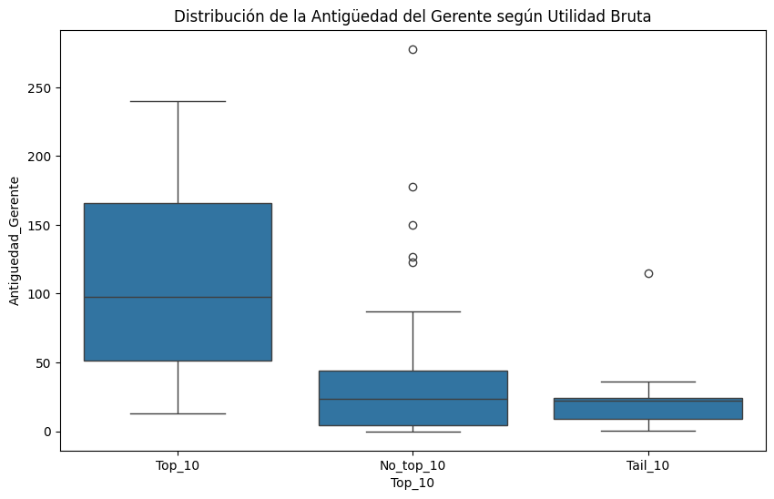

# 📊 Store24 (A): Gestión de Retención de Empleados

Este proyecto documenta y analiza el caso **Store24 (A)** de Harvard Business School, enfocado en la **retención de empleados** y su impacto en el desempeño financiero de una cadena de tiendas de conveniencia.

---

## 📌 Contexto

- **Empresa:** Store24  
- **Región:** Nueva Inglaterra (EE.UU.)  
- **Año de análisis:** 2000 – 2001  
- **Tiendas:** 82 (datos disponibles de 75)  
- **Problema central:** Alta rotación y baja antigüedad de empleados.  
- **Equipo directivo:**  
  - Bob Gordon – CEO  
  - Paul Doucette – CFO  
  - Tom Hart – COO  
  - Sarah Jenkins – Pasante MBA (responsable del análisis)

---

## 🎯 Objetivo del análisis

Evaluar el **impacto de la antigüedad de gerentes y personal en el desempeño financiero** de las tiendas, considerando además los factores de ubicación.

El caso busca responder:
1. ¿Vale la pena invertir en salarios, bonificaciones, capacitación y desarrollo profesional?  
2. ¿Cuál es el impacto financiero de aumentar la antigüedad en promedio 1,38 meses?  
3. ¿Cómo se comparan los efectos de la antigüedad frente a factores de ubicación (población, competencia, visibilidad, tráfico peatonal, etc.)?

---

## 📂 Datos disponibles

El dataset (Anexo 3 del caso) contiene información de **75 tiendas**:

- **Variables financieras:**
  - Ventas (FY2000)  
  - Utilidad (FY2000, antes de gastos indirectos)  

- **Variables de personal:**
  - Antigüedad en el puesto de gerentes (meses)  
  - Antigüedad en el puesto de personal (meses)  

- **Factores de ubicación:**
  - Competencia (tiendas competidoras por 10,000 personas en radio de 0.5 milla)  
  - Población (radio de 0.5 milla)  
  - Visibilidad (escala 1–5)  
  - Volumen de peatones (escala 1–5)  
  - Indicador: tienda abierta 24 horas  
  - Indicador: tienda en zona residencial  

---

## 📊 Hallazgos preliminares

- Las **10 tiendas más rentables** presentan **antigüedad casi 4 veces mayor** que las 10 menos rentables.  
- Existe evidencia de que la relación **antigüedad ↔ desempeño** podría ser **no lineal**:  
  - Alto impacto en tiendas con baja experiencia acumulada.  
  - Bajo impacto en tiendas con personal ya experimentado.  
- Factores de ubicación generan alta dispersión en resultados (ejemplo: población varía entre 1,046 y 26,519 en 0.5 milla).

---

## 🛠️ Metodología de análisis sugerida

1. **Análisis descriptivo**  
   - Medias, desviaciones, correlaciones.  
2. **Modelos de regresión**  
   - Utilidad como variable dependiente.  
   - Variables explicativas: antigüedad (gerentes, personal) y ubicación.  
   - Probar modelos lineales y no lineales (efecto decreciente de la antigüedad).  
3. **Escenarios de simulación**  
   - Incremento de 1.38 meses en antigüedad del personal.  
   - Comparación con mejoras en ubicación (ej. +1 en visibilidad, +1 en tráfico peatonal).  

---

## 📌 Conclusiones esperadas

- La retención de empleados (especialmente en niveles bajos de antigüedad) **sí tiene impacto positivo en la rentabilidad**.  
- Sin embargo, los factores de ubicación **también explican gran parte de la variación** en desempeño.  
- Se recomienda una **estrategia mixta**:  
  - Bonos e incentivos vinculados a la retención en tiendas de baja antigüedad.  
  - Inversiones en capacitación y desarrollo profesional para reducir rotación.  
  - Considerar criterios de ubicación al evaluar expansión de tiendas.

---

## 📖 Fuente

Caso Harvard Business School:  
**Store24 (A): Gestión de Retención de Empleados (607-S04, versión en español del caso 602096).**  
Autores: Frances X. Frei y Dennis Campbell.  
