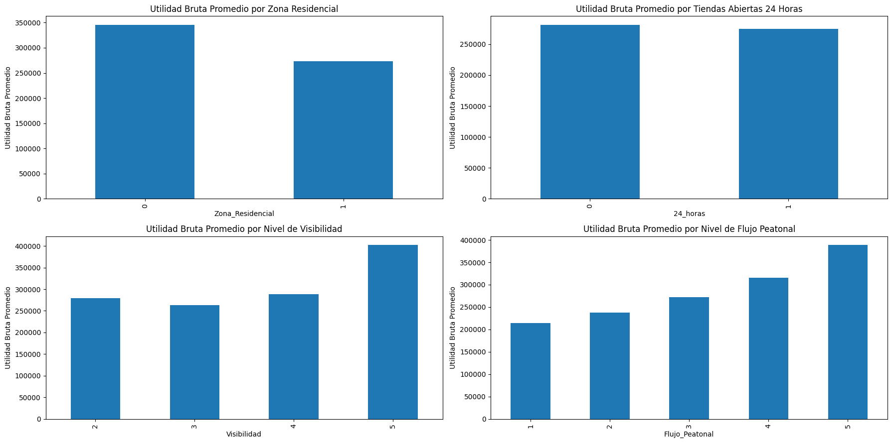
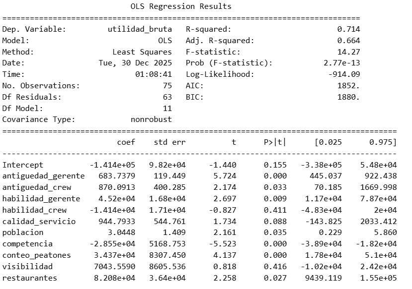

# Análisis de Retención de Empleados 

Una cadena de tiendas tiene en mente proponer estrategias para retener a sus empleados. Análisis rápidos y prácticos, obtuvieron que las 10 tiendas con mayor rentabilidad, tenían personal con más tiempo laborando en el negocio. Para ser exacto casi 4 veces más de las 10 tieandas menos rentables. 

***Figura 1***

La comparación entre las tiendas de mayor y menor desempeño revela que la retención del talento no es solo una métrica de RR.HH., sino un determinante estructural de la rentabilidad. Los datos muestran una brecha crítica: las tiendas más rentables operan con gerentes que poseen, en promedio, cuatro veces más experiencia institucional que sus contrapartes en tiendas de bajo rendimiento. Esta estabilidad en el liderazgo se traduce en equipos operativos tres veces más consolidados. La conclusión es clara: la alta rotación en las tiendas "Bottom 10" está erosionando los márgenes; por lo tanto, la estrategia de recuperación debe priorizar intervenciones de retención agresivas para frenar la fuga de conocimiento operativo y gerencial.

Entonces,*¿es necesario implementar alguna estrategia para que los empleados sigan trabajando con la empresa?* 

Mostramos un gráfico de dispersión para ver mucho mejor la relación de la antiguedad del personal y el desempeño financiero de las tiendas.

***Figura 2***

El análisis de los datos identifica una correlación estratégica directa entre la estabilidad del equipo gerencial y el desempeño financiero: a mayor antigüedad del gerente, se observa consistentemente una mayor Utilidad Bruta, lo que valida el retorno de inversión en la retención del liderazgo y su curva de aprendizaje. Por el contrario, la fuerza laboral operativa presenta una alta rotación en el corto plazo sin una relación lineal clara con la rentabilidad, sugiriendo que, para maximizar los márgenes actuales, la prioridad organizacional debe centrarse en consolidar y retener al talento directivo clave, mientras se revisan las eficiencias en la gestión del personal de base.

***Figura 3***

El análisis de los fundamentales operativos y de ubicación revela que la rentabilidad de la red está impulsada primariamente por el tráfico orgánico y la ubicación comercial, más que por la extensión de la jornada operativa. Mientras que el Flujo Peatonal actúa como el predictor lineal más robusto del desempeño financiero, la variable Visibilidad demuestra un comportamiento de 'umbral': solo las ubicaciones con visibilidad óptima (Nivel 5) generan un retorno diferencial significativo. Críticamente, el modelo de apertura 24 horas no está traduciéndose en mayor utilidad bruta promedio, lo que levanta una bandera roja sobre la eficiencia de costos en horario extendido frente a tiendas ubicadas en zonas residenciales, las cuales muestran un desempeño inferior comparado con los clústeres comerciales.

***Tabla 1 Modelo de Regresión Lineal*** 

"El modelo econométrico aísla los verdaderos motores de la rentabilidad, depurando el 'ruido' de los análisis visuales previos. Los hallazgos confirman que la Calidad y Estabilidad Gerencial son los activos internos más críticos: por cada incremento unitario en la habilidad del gerente, la utilidad aumenta en aprox. $45,200, y su antigüedad aporta un crecimiento sostenido adicional.

Externamente, la ubicación lo es todo, pero con matices: el tráfico peatonal es el predictor dominante de ingresos. Curiosamente, la presencia de otros restaurantes cercanos tiene un efecto positivo (efecto de aglomeración/clúster gastronómico, +$82k), mientras que la competencia directa genérica penaliza fuertemente la utilidad (-$28k).

Hallazgo Contraintuitivo: La 'Visibilidad' y la 'Habilidad del Personal Base' dejan de ser estadísticamente relevantes cuando se controla por otros factores. Esto sugiere que invertir en locaciones con alto tráfico orgánico es más rentable que pagar primas por visibilidad visual, y que la excelencia del gerente compensa las variaciones en la destreza del equipo operativo."